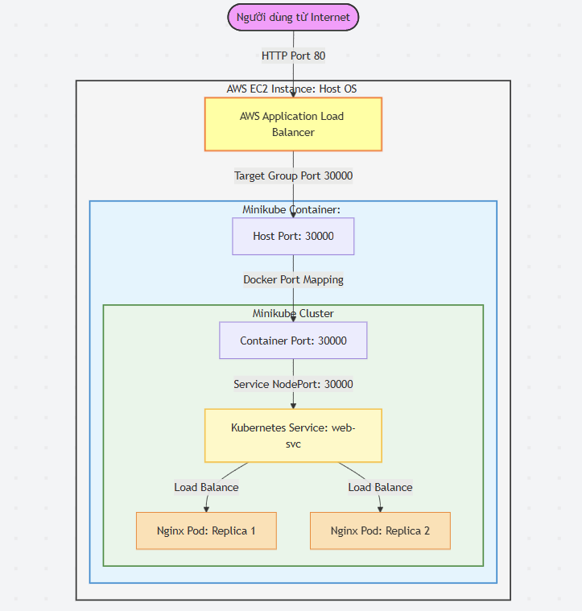

# K8s on AWS — Terraform 1-Click Challenge

Dự án này tự động hóa hoàn toàn việc triển khai một cụm Kubernetes (Minikube) chạy trong một máy ảo EC2 trên AWS bằng **Terraform (1-click)**. Ứng dụng Nginx chạy trong Kubernetes được expose ra ngoài Internet thông qua **Application Load Balancer (ALB)**.

---

## 📁 Cấu Trúc Dự Án (Project Structure)

Dự án được cấu trúc theo tiêu chuẩn thiết kế module chuyên nghiệp:

```
lab-K8sOnAWS/
├── .gitignore          # Cấu hình bỏ qua các file nhạy cảm (như key .pem, state file) khi đẩy lên Git
├── providers.tf        # Khai báo các Terraform providers (AWS, TLS, Local) và phiên bản yêu cầu
├── variables.tf        # Định nghĩa các tham số đầu vào cấu hình (Region, cấu hình EC2, Disk size)
├── outputs.tf          # Định nghĩa dữ liệu đầu ra (Link truy cập ALB URL, IP của EC2)
├── network.tf          # Truy vấn thông tin VPC và Subnets mặc định từ AWS
├── security.tf         # Thiết lập các nhóm bảo mật (Security Groups) cho ALB và EC2
├── compute.tf          # Triển khai SSH Key và máy ảo EC2 (tích hợp script cài đặt tự động)
├── load_balancer.tf    # Triển khai ALB, Target Group cổng 30000 và Listener cổng 80
├── README.md           # Hướng dẫn chạy dự án, luồng dữ liệu và cấu trúc dự án
├── EXPLAINER.md        # Tài liệu hướng dẫn tự học chi tiết, giải nghĩa thuật ngữ và cẩm nang sửa lỗi
├── k8s/
│   └── app.yaml        # Khai báo Kubernetes (ConfigMap tùy biến HTML, Deployment Nginx, Service NodePort)
└── scripts/
    └── bootstrap.sh    # Script tự động chạy trên EC2 (cài Docker, cài Minikube, Kubectl và deploy ứng dụng)
```

---

## 🏗️ Sơ đồ Kiến trúc & Luồng Dữ liệu (Traffic Flow)



### Chi tiết luồng đi của request:
1. **Client** gửi request HTTP đến DNS của **ALB** ở cổng `80`.
2. **ALB** chuyển tiếp traffic đến **Target Group** đăng ký máy ảo EC2 ở cổng `30000`.
3. Tại máy ảo **EC2**, cổng `30000` được ánh xạ thẳng vào bên trong container **Minikube** (thông qua Docker port map lúc start: `--ports=30000:30000`).
4. Bên trong **Minikube**, service **web-svc** thuộc loại **NodePort** lắng nghe tại cổng `30000` sẽ nhận traffic và phân phối đều tới các **Pod Nginx** đang chạy.

---

## 🛠️ Tích hợp Đa Providers (Wire Providers)
Để đáp ứng ràng buộc của đề bài cần sử dụng ít nhất **2 Terraform providers**, dự án này kết hợp **3 providers**:
1. **`hashicorp/aws`**: Quản lý toàn bộ hạ tầng đám mây (VPC, Security Groups, EC2 instance, ALB, Target Group, Listeners).
2. **`hashicorp/tls`**: Tự động tạo cặp khóa SSH Key Pair riêng tư và công khai theo thuật toán RSA dạng khai báo (declarative) mà không cần tạo file khóa thủ công.
3. **`hashicorp/local`**: Lưu khóa riêng tư (`.pem`) xuống ổ đĩa cục bộ trên máy bạn để bạn có thể sử dụng file này SSH trực tiếp vào EC2 để kiểm tra/gỡ lỗi.

---

## 🚀 Hướng dẫn Chạy (Quick Start)

### 1. Chuẩn bị tài khoản AWS
Đảm bảo bạn đã cấu hình AWS CLI credentials trên máy cục bộ của bạn (`aws configure` hoặc qua biến môi trường `AWS_ACCESS_KEY_ID` và `AWS_SECRET_ACCESS_KEY`).

### 2. Triển khai hạ tầng (1-Click)
Tại thư mục chứa mã nguồn, chạy các lệnh sau:

```bash
# Khởi tạo providers và tải plugins
terraform init

# Kiểm tra các tài nguyên sẽ tạo
terraform plan

# Tiến hành tạo tự động
terraform apply -auto-approve
```

### 3. Đợi cài đặt và Kiểm tra
Sau khi lệnh `terraform apply` kết thúc thành công, bạn sẽ nhận được 2 output ở terminal:
- `app_url`: Link truy cập ứng dụng Nginx (trang web qua cổng 80 của ALB).
- `ec2_public_ip`: Địa chỉ IP public của EC2.

> ⚠️ **Lưu ý quan trọng**: Quá trình cài đặt Docker, tải Minikube, khởi tạo cụm K8s và pull image Nginx trong User Data chạy ngầm trên máy ảo EC2 và thường mất khoảng **3 - 5 phút** để hoàn tất. Trong thời gian này, ALB có thể báo trạng thái *Unhealthy* và trả về lỗi `502 Bad Gateway`. Hãy đợi vài phút rồi tải lại trang.

---

## 🔍 Hướng dẫn Debug / Troubleshooting

Nếu gặp sự cố hoặc muốn kiểm tra trạng thái bên trong cụm K8s:

### 1. SSH vào máy ảo EC2
Sử dụng file private key đã được tự động tải xuống thư mục làm việc:

```bash
# Gán quyền đọc cho file key (trên Linux/macOS)
chmod 400 k8s-lab-key.pem

# Kết nối SSH
ssh -i k8s-lab-key.pem ubuntu@<EC2_PUBLIC_IP>
```

### 2. Xem logs quá trình cài đặt
Sau khi SSH vào máy ảo, chạy lệnh sau để kiểm tra quá trình bootstrap:
```bash
tail -f /var/log/user-data.log
```

### 3. Kiểm tra cụm Kubernetes nội bộ
Với tư cách root user (hoặc dùng `sudo`):
```bash
sudo su -
export KUBECONFIG=/root/.kube/config

# Kiểm tra các node
kubectl get nodes

# Kiểm tra pods, services
kubectl get pods,svc -A
```

---

## 🧹 Dọn dẹp Tài nguyên (Tránh phát sinh chi phí)
Sau khi kết thúc bài lab, hãy giải phóng tài nguyên để không bị AWS tính phí:

```bash
terraform destroy -auto-approve
```
