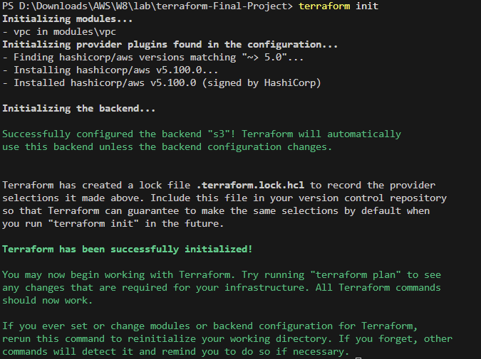
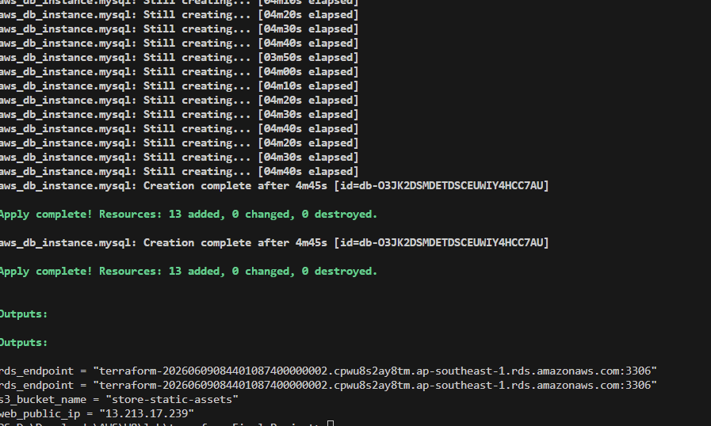
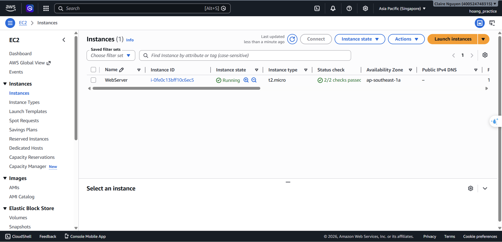
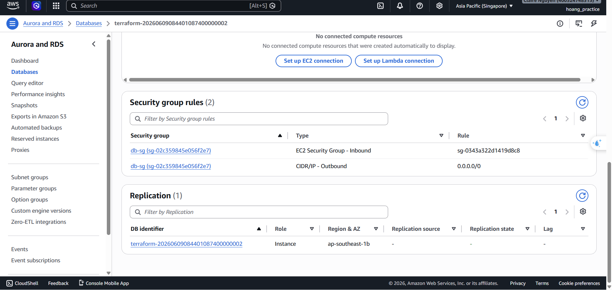
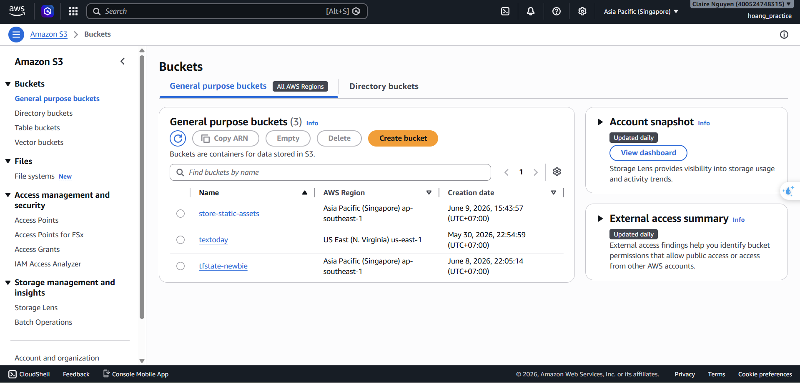
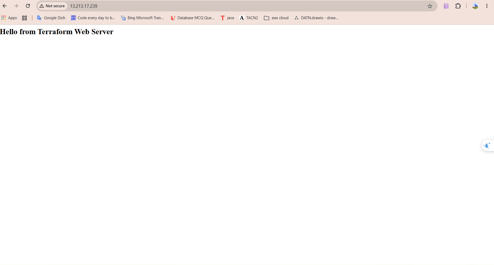

# AWS Web Application Infrastructure with Terraform

This project provisions a secure, scalable, and standard web application infrastructure on AWS using Terraform. It includes a custom VPC module, a public web server (EC2), a private MySQL database (RDS), and an S3 bucket for static assets.

---

## 📂 Project Structure

```text
terraform-final-project/
│
├── modules/
│   └── vpc/               # Custom VPC Module (Step 1)
│       ├── main.tf        # VPC, Subnets, Route Tables, IGW
│       ├── variables.tf   # Module variables
│       └── outputs.tf     # Module output values (vpc_id, subnet_ids)
│
├── backend.tf             # S3 Backend & AWS Provider configuration
├── main.tf                # Main configuration (EC2, RDS, S3, Security Groups)
├── variables.tf           # Root variables (optional placeholders)
├── outputs.tf             # Root outputs (Web Public IP, RDS Endpoint, S3 Name)
├── README.md              # Quick start guide (this file)
└── EXPLAINER.md           # In-depth architectural & deployment explanation
```

---

## 🛠️ Prerequisites

Before running the Terraform configuration, make sure you have:
1. **AWS CLI** installed and configured (`aws configure`).
2. **Terraform CLI** installed.
3. **An S3 Bucket** created manually on AWS to act as the backend for state storage (e.g., `tfstate-newbie`).
4. **DynamoDB table** (optional) named `terraform-state-lock` with Partition Key `LockID` (string) for state locking.

---

## 🚀 Quick Start Guide

### 1. Configure S3 Backend
Open [backend.tf](file:///d:/Downloads/AWS/W8/lab/terraform-Final-Project/backend.tf) and update the `bucket` name to your manually created bucket:
```hcl
bucket = "your-actual-tfstate-bucket"
```

### 2. Configure S3 Asset Bucket Name
Open [main.tf](file:///d:/Downloads/AWS/W8/lab/terraform-Final-Project/main.tf) and update the S3 bucket name (line 109) to be globally unique:
```hcl
bucket = "your-name-static-assets-unique-id"
```

### 3. Initialize Terraform
This downloads the AWS provider and initializes the S3 backend:
```bash
terraform init
```

### 4. Review Plan
Validate what resources Terraform will create:
```bash
terraform plan
```

### 5. Apply Changes
Deploy the infrastructure to AWS:
```bash
terraform apply -auto-approve
```

### 6. Clean Up
To avoid charges, destroy all created resources when done:
```bash
terraform destroy -auto-approve
```

---

## 📸 Deployment & Verification Evidence

Here are the verification screenshots for each phase of the project deployment.

### 1. Terraform Initialization (`terraform init`)
Successfully initialized the S3 backend and downloaded the HashiCorp AWS provider:


### 2. Infrastructure Provisioning (`terraform apply`)
All 10 resources successfully created on AWS with output values displayed:


### 3. AWS Console Resource Verification
*   **EC2 Web Server**: Running in the public subnet with the correct Security Group:
    

*   **RDS MySQL Database**: Placed securely in the private DB subnet group:
    

*   **S3 Bucket for Static Assets**: Created successfully with global uniqueness:
    

### 4. Application Verification
Web browser accessing the EC2 Instance via its Public IP, displaying the custom index page served by Apache:


---

*For an in-depth understanding of the architecture, design choices, and security rules, check out the [EXPLAINER.md](file:///d:/Downloads/AWS/W8/lab/terraform-Final-Project/EXPLAINER.md) file.*
