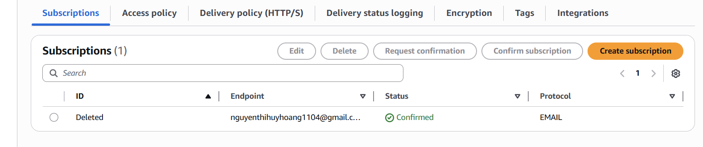

Hands-On: EC2 CPU Alarm → Email via SNS

Mục tiêu
- Tạo SNS topic và subscription (email)
- Tạo CloudWatch Alarm cho EC2 CPU > 80% (5 phút)

File chính
- `terraform/main.tf` - tài nguyên AWS (SNS, subscription, CloudWatch alarm)
- `terraform/variables.tf` - biến Terraform
- `terraform/outputs.tf` - output ARN và alarm
- `terraform/terraform.tfvars` - ví dụ giá trị

Chạy thử
1) Cài Terraform và cấu hình AWS credentials (via `aws configure` hoặc env vars).

2) Khởi tạo và xem plan:

```bash
cd lab/aMinh/terraform
terraform init
terraform plan -var="email_address=nguyenthihuyhoang1104@gmail.com" -var="instance_id=i-0123456789abcdef0"
```

3) Áp dụng:

```bash
terraform apply -var="email_address=nguyenthihuyhoang1104@gmail.com" -var="instance_id=i-04bc3ed06a60bac1d" -auto-approve
```

4) Xác nhận subscription: SNS sẽ gửi email xác nhận — mở email và click link để kích hoạt subscription.

5) Kiểm tra Alarm: Sử dụng AWS Console → CloudWatch → Alarms để xem `ec2-cpu-high-80pct`. Khi trạng thái `ALARM` sẽ gửi notification tới email.

Tăng CPU nhanh trên EC2 (Linux):
- SSH vào instance EC2.
- Nếu có `stress`:
  ```bash
  sudo yum install -y stress || sudo apt-get update -y && sudo apt-get install -y stress
  stress --cpu 4 --timeout 600
  ```
- Nếu không có `stress`, dùng `yes` để tạo tải CPU:
  ```bash
  for i in 1 2 3 4; do yes > /dev/null & done
  sleep 600
  killall yes
  ```

Chú ý: alarm yêu cầu CPU trung bình > 80% trong 5 phút, nên bạn phải giữ tải liên tục ít nhất 5 phút.

Dọn dẹp
```bash
terraform destroy -var="email_address=nguyenthihuyhoang1104@gmail.com" -var="instance_id=i-04bc3ed06a60bac1d" -auto-approve
```

Ghi lại bằng chứng
- Lưu screenshot của email subscription confirmation (đặt trong `screenshots/`).
- Lưu screenshot của CloudWatch Alarm state -> `ALARM`.


cd